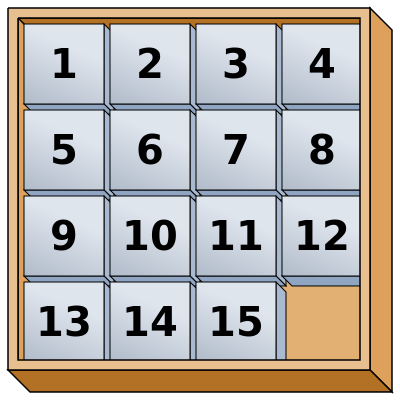

15-Peli-ratkaisija
=======

15-Peli (engl. 15-puzzle tai Boss puzzle) on ongelman ratkaisupeli, jossa 15 numeroitua laattaa on sijoitettuna tavallisimmin
4 kertaa 4 kokoiseen laatikkoon. Näin laatikkoon jää yksi tyhjä kolo pelilaattojen siirtämistä varten. Pelin alussa pelilaatat on sijoitettu pelilaatikkoon
epäjärjestykseen. Pelaajan tehtävänä on saada pelilaatat siirrettyä takaisin numerojärjestykseen liu'uttamalla palikoita yksi
kerrallaan viereisestä ruudusta kulloinkin tyhjänä olevaan ruutuun niin, että lopussa tyhjä ruutu on laatikon oikeassa 
alakulmassa. 

Kaiken kaikkiaan pelilaatat voitaisiin asetella pelilaatikkoon 16! = 20 922 789 888 000 tavalla, mutta näistä yli 20 biljoonasta tavasta läheskään kaikki eivät ole pelin mahdollisia alkutilanteita. Woolssey Jonhsson ja Willian E. Story osoittivat vuonna 1879, että vain puolet kaikista mahdollisista pelilaattojen kombinaatioista on sellaisia joista peli voidaan ratkaista.

Työn tavoite
-------

Työn tavoitteena on toteuttaa 15-pelille ratkaisija, joka pystyy ratkaisemaan pelin mistä tahansa alkutilanteesta, josta peli ylipäätään on ratkaistavissa. On osoitettu, että 15-peli pystytään ratkaisemaan korkeintaan 80 siirrolla, mistä tahansa alkutilanteesta. En tavoittele työssäni juuri optimaallisimman ratkaisun löytämistä, vaan pyrin toteuttamaan algoritmin, joka ratkaisee ongelman järkevässä ajassa.

Tarvittavat tietorakenteet
-------

Teoriassa peli voitaisiin ratkaista niin, että peliä lähdettäisiin pelaamaan kaikkiin mahdollisiin suuntiin. Tämä olisi kuitenkin erittäin tehotonta. Erilaisten pelitilanteiden voidaan ajatella muodostavan pelipuun, jossa jokainen mahdollinen pelitilanne edustaa yhtä solmua. Koska jokaisessa pelitilanteessa tyhjään ruutuun voidaan sijoittaa keskimäärin kolme uutta pelilaattaa, on jokaisella pelitilannetta edustavalla solmulla keskimäärin kolme uutta pelitilannetta lapsinaan. Näin ollen mahdollisten pelitilanteiden määrä kasvaa eksponentiaalisesti suhteessa tehtyjen siirtojen lukumäärään nähden. Mikäli peli ratkeaisi viidellä siirrolla olisi käytävä läpi pahimmillaan 3^1 + 3^2 + 3^3 + 3^4 + 3^5 = 356 uutta pelitilannetta. Harva 15-peli ratkeaa vain 5 siirrolla, joten todellisuudessa uusia pelitilanteita syntyy merkittävästi enemmän. Jos peli ratkeaisi esimerkiksi 20 siirrolla, olisi pahimmillaan käytävä läpi 5 230 176 600 uutta pelitilannetta, ennen kuin ratkaisu löytyisi. Tilannetta voidaan optimoida poistamalla pelipuusta kaikki ne haarat, jotka johtaisivat solmun vanhemman pelitilanteeseen. Toisin sanoen puusta poistettaisiin kaikki ne haarat, joissa palikkaa x siirretään ensin vasemmalle ja sen jälkeen takaisin oikealle. Tällöin saisimme vaihtoehtojen määrän putoamaan kolmen potenssista kahden potenssiksi, mutta tilanne olisi edelleen eksponentiaalinen. Jos esimerksi peli vaatisi 80 siirtoa ratketakseen (17 mahdollista aloitustilannetta ovat tällaisiä), olisi uusia pelitilanteita 2 417 851 639 229 258 349 412 350 kappaletta. 

Jotta 15-peli pystyttäisiin ratkaisemaan tehokkaasti, jokainen pelitilanne täytyy pystyä pisteyttämään sen mukaan, kuinka lähellä optimaallista ratkaisua peli on. Tällöin voimme käyttää pelitilanteiden järjestämiseen prioriteettijonoa (kekoa), jolloin käsiteltäväksi nostettaisiin aina se pelitilanne, joka näyttäisi sillä hetkellä pelin ratkeamisen kannalta optimaallisimmilta. Keon lisäksi tehokkaaseen algoritmiin tarvitaan ainakin hajautustaulua. Hajautustaulun avulla voidaan tarkistaa tehokkaasti, onko kyseinen pelitilanne jo käyty läpi algoritmin aiemmassa suoritusvaiheessa.
